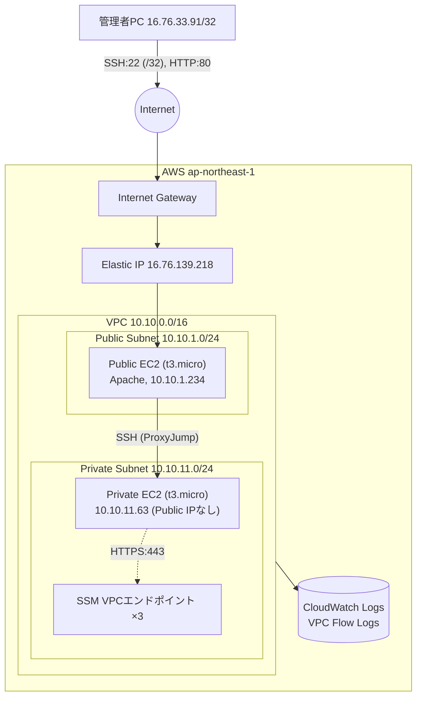

# aws-network-lab

AWSネットワーク検証ポートフォリオ Phase 1(VPC・EC2基礎)。TerraformとAWS CLIで構築し、CML2(別リポジトリ `mst-verification-lab`)と同じ「実出力を証跡として残す」方針のもと、VPC/EC2/Security Group/NACL/Private EC2/Session Manager/VPC Flow Logsの検証1〜6と、3種類の障害注入試験を実施した。

リージョン: `ap-northeast-1`。全リソースに `aws-network-lab` のプレフィックス/タグを付与し、既存リソースとは独立。

## 構成図



詳細版は `docs/architecture.md` を参照。

## 各AWSサービスの役割

VPC / Subnet / IGW / Route Table / Security Group / NACL / EIP / EC2 / IAM Role / VPCエンドポイント / Flow Logsそれぞれの役割は `docs/architecture.md` の表を参照。

## 構築手順

前提: AWS CLI、Terraform、SSH鍵ペア(`ssh-keygen -t ed25519 -f ~/.ssh/aws-network-lab`)、AWS SSOプロファイル(`aws configure sso`)。

```powershell
cd aws-network-lab\terraform
cp terraform.tfvars.example terraform.tfvars   # 各自の環境に合わせて編集(このファイルはgitignore対象)

terraform init
terraform fmt
terraform validate
terraform plan -out aws-network-lab.tfplan
# 内容を確認してから:
terraform apply aws-network-lab.tfplan
```

検証5(Session Manager)でPrivate EC2への経路が必要な場合のみ、`terraform.tfvars` に `enable_ssm_vpc_endpoints = true` を追加して再度 plan/apply する(追加課金あり、`docs/cost-and-cleanup.md` 参照)。

## 検証コマンドと結果

すべて `scripts/verify.sh [1|2|3|4|all]` で自動化。実行結果は `evidence/` 配下に保存済み。

### 検証1: Public EC2

```
curl -i http://<EIP>/
ssh -i <key> ec2-user@<EIP> "hostname; ip -4 addr show; ip route"
```

**正常時の期待結果**: HTTP 200、`ip route` に `default via <public subnet gw> dev ens5` が表示される。
**実測**: 期待通り(`evidence/01-public-ec2/`)。

### 検証2: Security Group(ステートフル)

```
aws ec2 describe-security-group-rules --filters Name=group-id,Values=<sg-id>
curl -o /dev/null -w "%{http_code}" http://<EIP>/
```

**正常時の期待結果**: SSH(22)は管理者IP `/32` のみ、HTTP(80)は全許可。往復とも単一方向のルールで通信が成立する(ステートフル)。
**実測**: 期待通り。障害試験でHTTPルールを外してもSSHは無影響であることを確認(`evidence/02-security-group/`)。

### 検証3: NACL(ステートレス)

```
aws ec2 describe-network-acls --network-acl-ids <nacl-id>
```

**正常時の期待結果**: 既定は全許可(allow -1 both directions)。往復それぞれに個別ルールが必要(ステートレス)であることを、障害試験で戻りエフェメラルポートを拒否することで実証。
**実測**: 期待通り。インバウンド80は`ACCEPT`のまま、アウトバウンド(src port 80)のみ`REJECT`になる非対称な結果を確認(`evidence/03-nacl/`)。

### 検証4: Private EC2(踏み台経由)

```
ssh -i <key> -o ProxyCommand="ssh -i <key> -W %h:%p ec2-user@<EIP>" ec2-user@<private-ip>
```

**正常時の期待結果**: Private EC2はPublic IPを持たず、ProxyJump/ProxyCommand経由でのみ到達可能。秘密鍵は操作端末に留まり、踏み台へはコピーしない。
**実測**: 期待通り(`evidence/04-private-ec2/`)。`-J` 単体では一部のOpenSSHビルドで踏み台ホップへ`-i`が継承されず認証失敗する事象を確認したため、`ProxyCommand`を明示する方式に変更した(詳細は`docs/troubleshooting.md`ではなく本READMEの「実行結果と設計上の考察」を参照)。

### 検証5: Session Manager

```
aws ssm describe-instance-information
aws ssm start-session --target <private-instance-id>
```

**正常時の期待結果**: SSHポート・踏み台を使わずPrivate EC2へ接続できる。
**実測**: Private EC2は初期状態ではNATがないためSSM未登録だった。ユーザー承認の上でSSM用VPCエンドポイント(ssm/ssmmessages/ec2messages)を追加作成し、登録・Session Manager接続に成功(`evidence/05-session-manager/`)。接続後、`curl http://example.com` は到達不可(NAT/IGW経路なし)であることも確認済み — SSM専用の最小経路のみが開通している。

### 検証6: VPC Flow Logs

```
aws logs get-log-events --log-group-name /aws-network-lab/aws-network-lab/vpc-flow-logs --log-stream-name <eni>-all
```

**正常時の期待結果**: ACCEPT/REJECT双方が記録され、送信元/宛先IP・ポート・actionが確認できる。
**実測**: 期待通り(`evidence/06-flow-logs/`)。加えて、**ルート欠落時はSG/NACLの評価を通過するため両方向ともACCEPTのまま記録され、Flow Logsだけでは疎通不可の原因を判別できない**ことを実測で確認した(詳細は次項および`docs/troubleshooting.md`)。

## 障害時の症状・原因の切り分け・復旧方法 / SG・NACL・ルート比較表

`docs/troubleshooting.md` に実測ベースの比較表と切り分けフローをまとめた。要点:

| 障害 | 症状 | Flow Logsの見え方 | 復旧 |
|---|---|---|---|
| SGでHTTP拒否 | HTTPのみタイムアウト、SSHは正常 | 該当ポートのみ`REJECT` | `terraform apply`(ドリフト自動修復) |
| NACLで戻りポート拒否 | HTTPタイムアウト(接続は確立するが応答なし) | 往路`ACCEPT`/復路`REJECT`の非対称 | `aws ec2 delete-network-acl-entry`(手動、Terraform管理外) |
| デフォルトルート欠落 | 全通信がタイムアウト | **両方向とも`ACCEPT`(限界)** | `terraform apply`(ドリフト自動修復) |

障害注入・復旧はすべて `scripts/inject-*-failure.sh` / `scripts/restore.sh` で自動化し、各試験は実行前にユーザー承認を得てから実施した。

## 費用が発生するリソースと`terraform destroy`による削除方法

詳細は `docs/cost-and-cleanup.md` を参照。要約:

- 課金対象: EC2 (t3.micro ×2)、EBS、CloudWatch Logs、SSM VPCエンドポイント(有効化時のみ、約$0.042/時)
- NAT Gatewayなど高額構成は本Phaseでは一切作成していない

```powershell
cd aws-network-lab\terraform
terraform plan -destroy
terraform destroy
```

## 実行結果と設計上の考察

- **34リソースのapplyは一発成功**(`terraform validate`/`plan`通過後、既存リソースへの影響ゼロで完了)。
- **`associate_public_ip_address`のドリフト**: EIPを関連付けた後、Terraformが「`associate_public_ip_address`が`true`に変わった」と誤検知し、EC2の再作成(`-/+`)を計画する事象が発生した。原因はAWS側がEIP付与後のインスタンスを「パブリックIPを持つ」として返すため。`lifecycle.ignore_changes`で吸収し、稼働中インスタンスを壊さずに追加変更(SSMエンドポイント)を適用できた。**IaCでEIP併用時はこの罠に注意が必要**、という実践的な知見が得られた。
- **SG/NACL/ルート変更はいずれも即時反映ではない**: API成功直後の1回のcurlでは変更前の結果が返り、10〜20秒程度で反映されるという伝播遅延を3試験すべてで実測した。障害試験の自動化スクリプトを書く際は、単発の確認ではなく数回のリトライを組み込む必要がある。
- **Flow Logsの限界を実測で裏付けた**: 「SG拒否とNACL拒否をFlow Logsだけでは完全には識別できない」という一般論を、実際にルート欠落時の両方向ACCEPTという形で再現・証跡化できた。
- **SSM Session Manager**: NAT Gatewayを使わずVPCエンドポイントのみで確立でき、Phase 1の時点で高額な常設コストを避けつつ目的(SSHレス接続)を達成できた。
- **ProxyJumpの落とし穴**: `-J`のみでは踏み台ホップへ秘密鍵が継承されないOpenSSHの挙動に実際に遭遇し、`ProxyCommand`を明示する方式に修正した。ドキュメントに残すことで再現時のコストを下げた。

## ディレクトリ構成

```
aws-network-lab/
├── README.md
├── .gitignore
├── docs/
│   ├── architecture.md
│   ├── test-plan.md
│   ├── troubleshooting.md
│   └── cost-and-cleanup.md
├── terraform/            # versions/providers/variables/main/network/security/ec2/iam/flow-logs/outputs.tf
├── scripts/              # verify.sh, collect-evidence.sh, inject-*-failure.sh, restore.sh
└── evidence/             # 01-public-ec2 ... 06-flow-logs (実show/curl/Flow Logs出力)
```

## 秘密情報の取り扱い

- AWSアカウントID・認証情報は本リポジトリのいかなるファイルにも含まれていない(`evidence/`配下は自動リダクション済み、`grep -r <account-id> evidence/` で空であることを確認済み)。
- `terraform.tfstate`, `*.tfvars`(`*.example`を除く), SSH秘密鍵は `.gitignore` で除外。
- SSH秘密鍵はローカル(`~/.ssh/aws-network-lab`)にのみ存在し、EC2やGitへコピーしていない。
