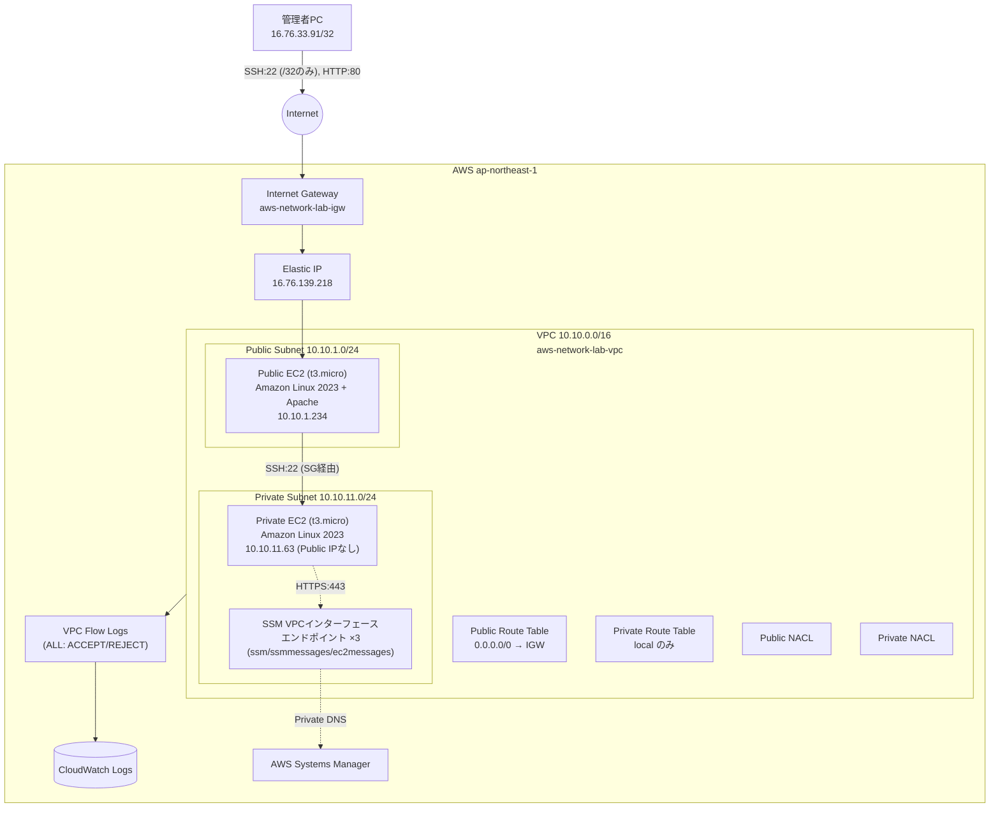

# アーキテクチャ

## 構成図

## 各AWSサービスの役割

| サービス | 役割 |
|---|---|
| **VPC** (10.10.0.0/16) | ラボ全体を収容する論理ネットワーク境界。DNSサポート/ホスト名解決を有効化 |
| **Public Subnet** (10.10.1.0/24) | インターネットからHTTP/SSHで到達可能なリソースを配置 |
| **Private Subnet** (10.10.11.0/24) | インターネットから直接到達不可のリソースを配置。デフォルトルートなし |
| **Internet Gateway** | VPCとインターネット間の双方向通信を可能にする |
| **Public Route Table** | `0.0.0.0/0 → IGW` を持ち、Public Subnetに関連付け |
| **Private Route Table** | ローカル(VPC内)ルートのみ。NAT/IGWへの経路を意図的に持たない |
| **Security Group (public)** | Public EC2向け。SSHは管理者IP `/32` のみ、HTTPは全許可、ステートフル |
| **Security Group (private)** | Private EC2向け。SSHはPublic EC2のSGからのみ許可 |
| **Security Group (vpce)** | SSM用VPCエンドポイント向け。Private EC2のSGからのHTTPSのみ許可 |
| **Network ACL (public/private)** | サブネット境界のステートレスなパケットフィルタ。既定は全許可、障害試験で意図的に制限 |
| **Elastic IP** | Public EC2に固定的なパブリックIPを提供(インスタンス再作成でもIP維持) |
| **EC2 (Public)** | Amazon Linux 2023、Apacheを起動しWebサーバーとして動作 |
| **EC2 (Private)** | Amazon Linux 2023。Public IPなし、SSM Agentプリインストール |
| **IAM Role (EC2用)** | `AmazonSSMManagedInstanceCore` を付与し、Session Manager経由の接続を可能にする |
| **VPCエンドポイント (ssm/ssmmessages/ec2messages)** | NAT Gatewayなしで Private EC2 が SSM サービスと通信するための経路(検証5で承認の上作成) |
| **VPC Flow Logs → CloudWatch Logs** | ENIを通過する通信のACCEPT/REJECTを記録。障害切り分けの一次情報源 |

## 設計上の判断

- **Public EC2にElastic IPを使う理由**: `associate_public_ip_address` を明示的に管理するとEIP付与後にTerraformが「再作成が必要」と誤検知する既知の挙動があるため、`lifecycle.ignore_changes` で吸収した上で、Subnet側は `map_public_ip_on_launch=false` とし、到達性はEIPのみに一本化した。
- **Private EC2にNAT Gatewayを使わない理由**: Phase 1の時点でNAT Gatewayを常設すると時間課金($0.062/時)が発生し続ける。Session Manager検証のみが目的であれば、より安価なVPCインターフェースエンドポイント(承認制・destroy可能)で十分。
- **カスタムNACLを作成する理由**: アカウントの暗黙のデフォルトNACLを直接操作すると影響範囲の把握が難しいため、本ラボ専用のNACLをサブネットに明示的に関連付け、障害試験のルール追加/削除をこのラボのリソースだけに限定した。
